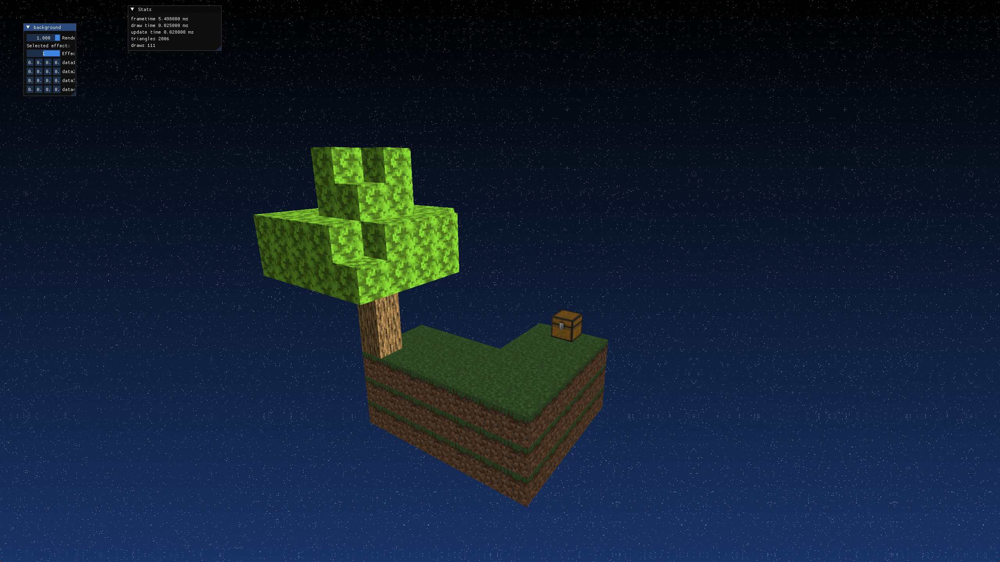

# Vulkan Game Engine

This is a basic Vulkan game engine, based on the [vkguide.dev](https://vkguide.dev/) template, demonstrating core Vulkan rendering concepts and modern C++ practices.



## Features

*   **Vulkan 1.3 API:** Utilizes the latest Vulkan API for high-performance graphics rendering.
*   **SDL2 for Window Management:** Handles window creation, input, and events.
*   **Vulkan Memory Allocator (VMA):** Employs VMA for efficient and robust GPU memory management.
*   **Dear ImGui Integration:** Provides an in-game overlay for debugging, profiling, and adjusting engine parameters (e.g., background effects).
*   **GLTF Model Loading:** Supports loading 3D models in the glTF format using the `fastgltf` library.
*   **PBR-like Rendering:** Implements a metallic-roughness workflow for physically-based rendering of GLTF models.
*   **Compute Shaders for Background Effects:** Dynamically generates backgrounds using compute shaders (e.g., gradient, sky effects).
*   **Basic Camera Controls:** Allows for navigation within the 3D scene.
*   **Per-Frame Resource Management:** Efficiently manages Vulkan resources using a frame-overlap system and deletion queues.
*   **Shader Compilation:** Automatically compiles GLSL shaders to SPIR-V using `glslangValidator` during the build process.

## Dependencies

This project relies on the following libraries:

*   **Vulkan SDK:** Required for Vulkan development (version 1.3 or higher).
*   **SDL2:** Simple DirectMedia Layer for cross-platform development.
*   **glm:** OpenGL Mathematics for vector and matrix operations.
*   **fastgltf:** A fast C++ glTF 2.0 parser.
*   **imgui:** Dear ImGui for immediate-mode GUI.
*   **vkbootstrap:** A Vulkan bootstrap library to simplify Vulkan initialization.
*   **vma:** Vulkan Memory Allocator.
*   **volk:** A Vulkan loader.
*   **fmt:** A formatting library for C++.

## Building the Project

To build this project, you will need CMake and a C++ compiler that supports C++17 or newer.

1.  **Install Vulkan SDK:** Ensure you have the Vulkan SDK installed and configured on your system.
2.  **Clone the repository:**
    ```bash
    git clone https://github.com/slugoguls/vulkanEngine.git
    cd vulkanEngine
    ```
3.  **Configure CMake:**
    ```bash
    cmake -S . -B build
    ```
4.  **Build the project:**
    ```bash
    cmake --build build
    ```
    This will compile the engine and its dependencies, including the shaders. The executable will be located in the `bin` directory.

## Running the Engine

After building, you can run the engine from the `bin` directory:

```bash
.\bin\vulkan_guide.exe # On Windows
```

## Usage

*   **Camera Controls:** Use the mouse and keyboard to navigate the scene.
*   **ImGui Panel:** Press `~` (tilde) or `F1` (or similar, depending on configuration) to toggle the ImGui debug overlay. Here you can adjust parameters like the render scale and switch between different background compute effects.

## Credits

This engine is based on the excellent tutorials and template provided by [vkguide.dev](https://vkguide.dev/).


